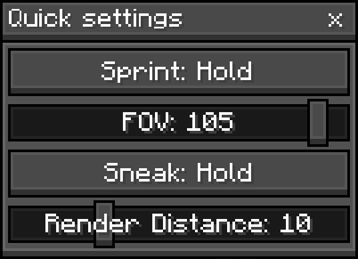

## 

Butterium is a feature-packed and user-friendly way to experience Minecraft without performance issues or a billion ugly configuration screens. Our **fine selection of performance mods and configurations** allows for your game to run **_smooth like butter_** on even the weakest hardware and devices. It's designed so that anyone— no matter if they're new to the game or already a pro PvP player— can enjoy the game _smoothly_, **without interruptions** with all the features and mods they like

We at BUTR Studios achieve lots of this by **integrating** each mod into **our very own custom-made ButterUI**. So, to put it simply, we achieve UX _perfection_ with **performance, quality of life and gameplay** all in one pack with **~42 mods.**

**Please view [the gallery](https://modrinth.com/modpack/butterium/gallery) to see more** UI, HUD and features

> ↳ _Mid-resolution gif of ButterUI customizations minimized to a small window_

## 
<blockquote style="color: inherit; border-left: 3px solid #FFCC00; opacity: 1;">

⚡ **Lightning fast performance** - Despite its large feature set, Butterium has comparable and sometimes better performance than the top performance packs and clients without being a bloated RAM hog _(especially in multiplayer)_
</blockquote>

<blockquote style="color: inherit; border-left: 3px solid #5f5f5f; opacity: 1;">

🎮 **Cool Gameplay/Multiplayer Features** - We have integrated mods for **freecam, fullbright, version-switching/spoofing, account switching, resource/shader pack browsing, voice chat** and more to ensure that you have **more than just _smooth_ frame rates** and nice GUI's
</blockquote>

<blockquote style="color: inherit; border-left: 3px solid #8998b3; opacity: 1;">

⚙️ **Custom Settings and GUI's** - We use FancyMenu to **fine-tune** our GUIs and **integrate** mods **using our own ButterUI design language**, integrated mods feature redesigned config screens accessible from Butterium menus and settings
</blockquote>

<blockquote style="color: inherit; border-left: 3px solid #5f5f5f; opacity: 1;">

🎮 **Custom HUD** - We integrate features like keystrokes, time, armor display, co-ordinates and more into Butterium's HUD, you can drag everything around with ease
</blockquote>

<blockquote style="color: inherit; border-left: 3px solid #ff6464; opacity: 1;">

📆 **Regular Updates** - BUTR Studios is dedicated to meeting user needs by **adding new features**, bug squashing and improving UX with every update
</blockquote>

## 
ButterUI is an OreUI-inspired design language featuring **user-friendly, abstract-looking menus** and **insane** customisation - you can simply change the **accent color and background** from our nice personalisation menu
> ↳ Or you could even enter FancyMenu (please read [the documentation](https://docs.fancymenu.net/)) and customise **EVERYTHING**- Not _easy_ but still super cool for advanced users

We provide ButterUI support for a whole bunch of mods- all included mods should be supported and a range of popular mods you can add yourself are supported to be consistent with ButterUI design. A list will be released soon on GitHub

The ButterUI experience is created using our own resources and FancyMenu configuration. I (caela.uk) work with FancyMenu **a lot** and have been for approximately 2 years now. I commonly push FancyMenu's limits and have to request tons of features, most of which Keksuccino kindly adds for me (and others) to make ButterUI better with

## 

We refer to Butterium as a **_Client-like_ modpack**. Lets explain **why**:

1) **Many** of our users have **switched** from using **popular clients to** using **Butterium**

2) Us devs make this pack feel as **custom made** for **you** as possible _(e.g **draggable window**s, **onboarding**)_

3) We're working to make this pack **integrate each mod** to **_perfection_**, from **custom menus**, **keybinds** and **commands**, to completely **custom mods** themselves _(coming soon)_

4) We are actively working on a client-like yet minimal launcher with the ability download and install the modpack from Modrinth automatically for those users who might be new to modpacks or transitioning from a popular client or vanilla

- [x] Add a "support us" widget

- [ ] ButterHost integration and features
> ↳ Like controlling the server and starting a free trial from in game _(referral systems too)_, hook in with the social features

- [ ] Installer, launcher and minimal mobile app
> ↳ https://github.com/BUTR-Studios/BUTR-Launcher

- [ ] Launcher Crash Assistant
> ↳ With Discord link and "copy logs" button

- [ ] Redesign HUD editor w/ support for resizable HUD widgets
> ↳ With sliders and submenus

- [ ] Optional translucent HUD widget backgrounds

- [ ] Set up Discord Status to include download button

- [ ] For cool events servers, show live events on a main menu widget

- [x] Move assets to resources
> ↳ Also allow resource pack to edit configs and stuff with txts like overrides (prompt first)

> Rework all icons as pixel-perfect images (maybe with seperate folder for included shadows)

> Move all text to localization keys

- [ ] Spec detection and optimization 
> ↳ https://github.com/BUTR-Studios/spec-engine

> Hardware scoring system, then finds optimal configs and modset for your hardware specifications

- [ ] Screenshot previews and viewer

- [ ] Elimination counter
> ↳ Maybe similar to Fortnite- skull icon?

> credit: fishandchips

- [ ] Custom HUD item counters
> ↳ e.g. gapples, arrows, potions

> credit: fishandchips

- [x] Armor and tool durability notifications
> ↳ credit: fishandchips

- [ ] Ports to 1.21.1 and 1.20.1 Fabric, maybe NeoForge one day

- [ ] Allow compatible mods to be installed and toggled from in-game
> ↳ "You have unsaved changes" text for when the user needs to restart their game

> Remove mods with .bat/.sh

> Inspired by Lunar and Feather mods screens- showing just icons, clicking them opens the description and/or config (maybe a description screen with a button for config)

- [ ] Update and enable friends sidebar
> ↳ With world/server invites, friends sidebar and social features are currently half-finished

- [ ] Click FX at the cursor
> ↳ Cool, customizable effect that follows accent colour

- [ ] Donate, help and Discord buttons somewhere in options

- [ ] Fix variable names and values + simplify and optimize all layouts and element anchors
> ↳ This will help users better understand Butterium and edit the FM configuration

- [ ] Known mod incompatibility warning from GitHub (ver).txt
> ↳ Compare loaded mods to a GitHub list of incompatible mods - also print to logs

> Possibly also "compatibility mode"

- [ ] Custom inventory shortcuts
> ↳ Should be styled like the inventory and also adapt to resource packs, maybe contact some RP creators to add support

- [x] Remove some layouts for settings menus
> ↳ Would improve mod compatability with mods that change settings

- [ ] Send specs to API on command using MC username for help support
> ↳ Optionally also logs but we must ask for the users explicit permission and warn them of what logs store before doing anything

- [ ] Advanced customisation button in personalisation and Credits menus that leads to new menu
> ↳ This menu should teach users how to create and download resource packs for Butterium

- [ ] Custom backgrounds replacing "0" in the BG carousel (.png, .jpg, .jpeg)

- [ ] Light and Midnight UI themes
> ↳ credit: fishandchips

- [x] Use the accent colour in more places and improve UI design

- [ ] Tools for resource pack creators
> ↳ W/ FMv3.8 - imagine making a resource pack just by walking around your world and clicking blocks to change their texture by selecting a png from your system. This will update the pack you're working on in real time but won't **replace** messing with files

- [ ] Toggleable health indicators
> ↳ Could be done with a resource pack or mod

> credit: fishandchips

## 

Most, if not all of our GUI's were created using the **amazing tool** that is **[FancyMenu](https://modrinth.com/mod/fancymenu) by [Keksuccino](https://modrinth.com/user/Keksuccino)**, this is amazing for creators as it allows for **custom** designs and scripting within Minecraft, faster and better than any custom mod we could ever create ourselves

Butterium has been a passion project of many names over the past 2 years and we wouldn't be here if not for our amazing community and supporters from the Minecraft modding scene

We protect our work here with the [Smooth Like BUTR Licence](https://github.com/BUTR-Studios/Modpacks/blob/Butterium/LICENCE.md)

<blockquote style="color: inherit; border-left: 3px solid #909090; opacity: 1;">

# Smooth Like BUTR Licence (SLBLv2)
Copyright © 2026 BUTR Studios and Caela Muñiz-Nelson

## 1. Creative Works, Assets & Design
All custom assets and creative works, including but not limited to:

- Custom Images, Animations, Logos or Branding

- Any code or scripts we create (Python, Bash, Batch, FancyMenu Actions, etc.)

- FancyMenu Layouts (`.txt` files from `config/fancymenu/customization/` and anything in the `config/fancymenu/assets/` folder)

- Our own built-in resources or resource packs (mainly located in `resources/`)

Are **strictly proprietary**. You may NOT redistribute or incorporate these into other software/modpacks without explicit written permission from the following email: legal@butr.uk

## 2. Simple Configurations
Permission is hereby granted free of charge to any person obtaining a copy of simple configuration files (mainly located in folders like `config/`) to:

- Modify and adapt the settings for personal or server use

- Share specific or few configurations and tweaks with the community and others

**Please note:** This strictly does NOT include the right to redistribute the entire `config/` folder as a standalone "copycat" pack since that would also contain our ceative works like assets and FancyMenu layouts.

## 3. General Terms
Our creative works or software (such as Modpacks or services) as a whole are provided "AS IS". This licence does not cover the individual dependencies, mods or shaders contained within software, which are subject to their own respective creators' licenses.

We do not care whether your PC grew legs and walked away or simply crashed to desktop; we provide no warranties. However, we do acknowledge our obligations stated under > the **UK Consumer Rights Act 2015**. Therefore, we may be liable for damage to your device or personal data if such damage is a **direct result** of our failure to use > reasonable care and skill when crafting our software or creative works. Beyond these legal requirements, you use our creative works and software entirely at your own > risk; though our staff and community will try to provide support wherever possible.

By continuing to use BUTR Studios software and creative works, **you generally agree to the most recent version of the Smooth Like BUTR Licence** found on the Licence's > GitHub [**LATEST.md**](https://github.com/BUTR-Studios/Smooth-Like-BUTR-Licence/blob/main/LATEST.md) file. We cannot hold you liable for newly added or edited rules > that may change your rights or obligations unless you have been given a **clear, reasonable notice** and have continued to use or redistribute our software/creative > works. Previous versions of the Smooth Like BUTR Licence will remain **archived and accessible** via the [`HISTORY/`](https://github.com/BUTR-Studios/Smooth-Like-BUTR-Licence/blob/main/HISTORY) folder on the Licence's GitHub purely for **transparency**.

For clarity, the term "we" in this licence most commonly refers to BUTR Studios and Caela Muñiz-Nelson (AKA caela.uk/caela-uk).

**Jurisdiction:** This licence is governed by the laws of England and Wales. Any disputes shall be handled exclusively in the courts of England and Wales.

## 4. A quick message from BUTR 💛
We are not Nintendo; we don't want to chase you down for copying the most simple of snippets or modifying assets to create a nice add-on for our packs (we LOVE that).

But- (and this is a very big but 🥁) if we do find you using our creative works in a way that poses a threat to us, we reserve the legal right to drop a very kind > **Cease and Desist** letter through your mailbox.

Honestly from vro to vro and to keep you safe, I would always recommend asking legal@butr.uk and crediting us before you copy anything that could be considered our > "creative works".

</blockquote>

## 

If you encounter any **incompatibilities, missing features or bugs** whilst using this modpack please report them to the BUTR Studios official Discord linked below **↓**

